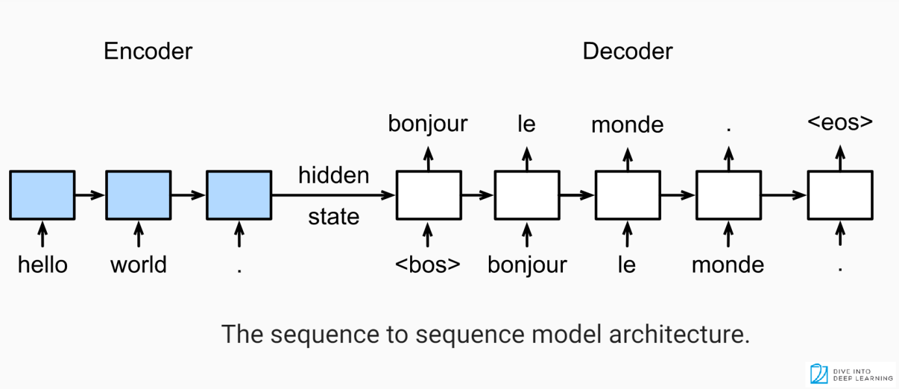
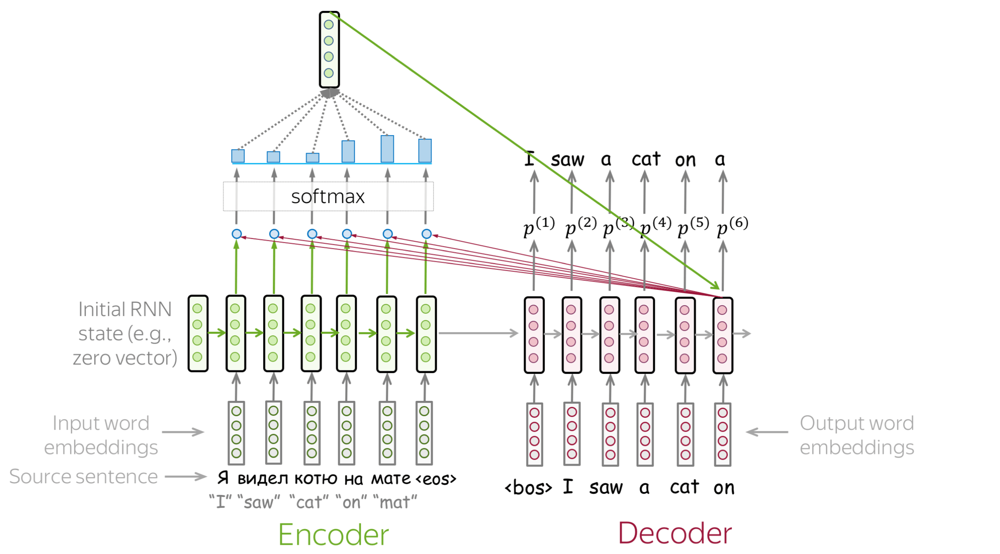
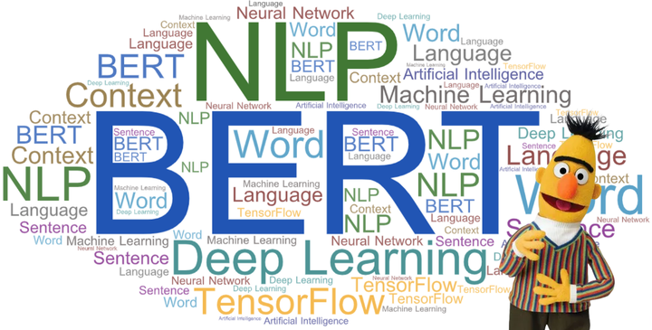

### Lab №2
Three experiments:
1. ***Seq2seq*** with simple ecoder/decoder, using LSTM-layers.  
2. Model with ***attention-decoder***. Attention layer isn't custom, imported from torch-nlp project. 
3. Last model is very strange experiment - I tried to import ***HuggingFace Bert*** model for English/Russian translation and cut lm_head and add custom fully connected neutral network. 
Let's see metrics table:

|    Metric     | Experiment №1 | Experiment №2 | Experiment №3 |
| ------------- | ------------- | ------------- | ------------- |
| Bleu  | 19.5  | 29.13 | 0.124 |
| Avg epoch time training  | 129.6 | 981.56 | 112.59 | 
| Avg batch time training  | 0.103 | 0.785 | 0.09
| Uplift of train loss and val loss difference* |  190.82 | 1659.48 | -25.79
* Estimate for every epoch uplift of difference between train and val loss and mean it.

***Summary:***
 Simple Seq2seq - baseline for other experiments. Attention give perfect results only on **5** epoches. But, experiment with Bert doesn't get any good results. I think its because our dataset has some bias and not good to train learning model or model has so big output layer dimention (of course always we can say about hyperparameters problem).
